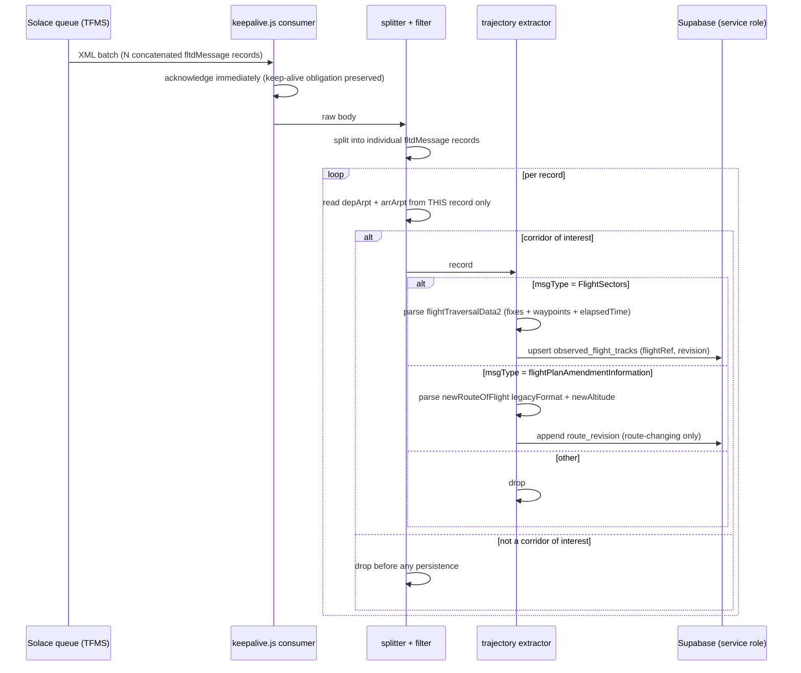
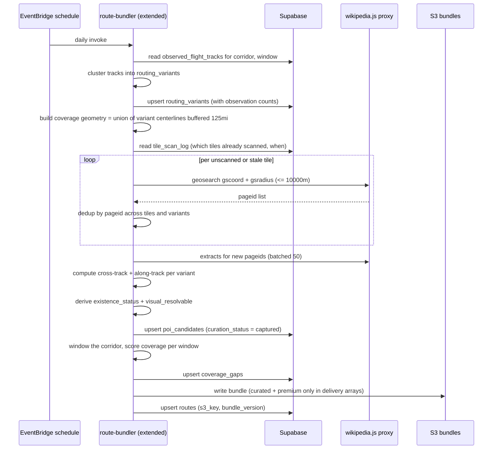

# Design Document: POI Route Ingestion

Status: design scope document, pre-implementation. Written to be argued against.

Companion document: `requirements.md` in this folder. Where the two disagree, requirements
win and this document should be updated to match, not the reverse.

Reconciled against `requirements.md` after requirements signoff. Place identity and
deduplication (Requirement 4.7 through 4.18) are covered by Component 5b, the
`poi_candidate_sources` and `poi_duplicate_reviews` data models, and Properties 12 through
16. Each correctness property carries a `Validates` reference to the requirement criteria it
exercises.

## Overview

This design covers a POI capture process: the machinery that decides what enters the
content corpus and where curated content still needs to be written. It has two halves.
The first half observes real filed and amended flight trajectories from the live FAA SWIM
feeds, so that corridor geometry is a record of what aircraft actually flew rather than a
single hand-drawn route array. The second half takes that observed geometry, buffers it by
a 125 mile interest radius, and captures POI candidates inside the resulting corridor,
annotating each candidate with the facts a downstream consumer needs in order to talk
about it safely.

The immediate motivation is that the existing corridor model cannot represent reality. Two
materially different DEN to SEA routings were observed in simultaneous use during live feed
investigation, diverging after the FAARM fix and separated by roughly 100 to 200 miles. A
passenger on the northern variant (via Mullan Pass, Spokane, Glasgow arrival) would never
encounter anything curated for the Idaho Falls corridor that the southern variant flies.
Static geometry makes that failure invisible, because nothing in the system knows the
aircraft is somewhere the content was not written for.

The second motivation is coverage honesty. The roadmap's stated end state is zero raw
Wikipedia POIs in production, with every delivered POI either premium or curated. Capture
therefore exists mostly to produce a prioritized answer to the question "where along the
real flown corridors does curated content not exist yet," not to produce a larger pile of
things to say. A wider captured corpus is acceptable as a research pool. The delivery gate
stays narrow.

## Scope Boundary: Capture Versus Delivery

This is the single most important boundary in this document, and everything else is
subordinate to it.

Capture decides what enters the corpus. Delivery decides what a passenger hears.

| Concern | Owner | In scope here |
|---|---|---|
| Observing real flown trajectories from SWIM | this design | yes |
| Persisting routing variants per corridor | this design | yes |
| Determining corridor coverage geometry | this design | yes |
| Capturing POI candidates inside that geometry | this design | yes |
| Recording per-candidate facts (visual resolvability, existence status, provenance, tier) | this design | yes |
| Producing the coverage gap report that prioritizes content writing | this design | yes |
| Producing the handoff artifact (route bundle) that delivery consumes | this design | yes, the artifact only |
| Whether a POI surfaces to a passenger | `poiEngine.js` | no |
| Geofence radius, firing order, re-fire, queue fall-out | `poiEngine.js` | no |
| Guide prompting, phrasing, visual language rules | `guide.js` | no |
| Anything a passenger sees or hears | existing delivery path | no |

### Non-scope, stated explicitly

This design does not specify passenger-facing surfacing, guide prompt content, POI firing
or geofence behavior, tier precedence at delivery time, conversation queueing, or map
marker behavior. Those are existing concerns owned by `poiEngine.js` and `guide.js`, and
they have their own open bugs tracked in the roadmap. Where this design touches the
boundary, it specifies the handoff artifact: the fields capture writes and guarantees, and
nothing about how they are consumed.

One consequence is worth stating plainly. A captured POI is a candidate. Capture has no
authority to mark anything as deliverable to a passenger. That authority belongs to
curation, expressed as a tier value that capture is not permitted to write. See the
`curation_status` state machine and Property 5.

## Grounding: What Was Verified Against the Live Feed

These are observations from the live feeds, not assumptions. They constrain the design.

### Feeds and current usage

Two SWIM subscriptions are live and connected. TFMS (VPN `TFMS`) carries R14 Flight Data
(All Data) plus R14 Flow Data at national scope, roughly 2,500 messages per 5 minutes,
which is on the order of 720,000 messages per day. STDDS (VPN `STDDS`) carries Surface
Movement Events, Position Reports and Tower Departure Events, filtered to KSEA and KDEN.

`swim-consumer/keepalive.js` runs 24/7 on the user's desktop, binds one consumer per feed
with `CLIENT` acknowledge mode, and acknowledges then discards every message. It exists
only to prove ongoing usage against FAA's roughly 30 day inactivity disablement check. It
already holds the connection, already reconnects with exponential backoff, and already
logs heartbeats every 5 minutes. It currently discards exactly the message type this
design needs.

### Message structure

TFMS messages are FIXM-derived XML batches. A single message body contains multiple
concatenated `<fdm:fltdMessage>` records for different flights. The design constraint that
follows is not stylistic: parsing must split the batch into individual records and match
departure and arrival airports within one record. Matching airport codes against the whole
batch string produces false positives, and this actually happened during investigation. A
batch containing KDEN in one flight's record and KSEA in an unrelated flight's record
matched as a DEN to SEA flight. Property 1 exists to prevent regression here.

Record attributes observed: `acid`, `airline`, `depArpt`, `arrArpt`, `msgType`,
`sourceTimeStamp`, `sourceFacility`, `flightRef`, `fdTrigger`, `major`, `cdmPart`.

Message types observed on DEN to SEA flights:

| msgType | Carries | Use here |
|---|---|---|
| `trackInformation` | live position (DMS lat/long), speed, `reportedAltitude`, arrival and departure fix and time, `nxcm:nextEvent` with decimal lat/long, eta. Roughly every 60 seconds. No route. | not retained by capture |
| `FlightSectors` (`fdTrigger` `AIRSPACE_ASSIGNMENT`, `sourceFacility` `TFMS`) | `nxcm:flightTraversalData2` with an ordered named fix list (`nxce:fix` with `sequenceNumber`, `elapsedTime` in seconds from departure) and decimal waypoints (`nxce:waypoint` with `latitudeDecimal`, `longitudeDecimal`, `sequenceNumber`, `elapsedTime`) | primary source. This is a 4D trajectory: position plus predicted time at each point |
| `flightPlanAmendmentInformation` (`fdTrigger` `HCS_AMENDMENT_MSG`) | `nxcm:amendmentData` with `nxcm:newRouteOfFlight` `legacyFormat`, `nxcm:newAltitude`, `nxcm:newSpeed`, `nxcm:newCoordinationPoint` | retained as a route revision signal |
| `FlightModify`, `FlightTimes` | eta, etd, `flightTimeData`, `diversionIndicator`, arrival and departure fix and time | time revisions only, not route changes |

`FlightSectors` was observed broadcast periodically for all flights in a burst: six DEN to
SEA flights arrived in one 02:28:28Z burst. This matters commercially, because it means
trajectory data is cheaply obtainable without catching the original flight plan filing.
Observation does not need to be perfectly reliable to be useful.

A real amendment was captured live: UAL360 at 02:30:30Z and again at 02:32:14Z, route
string `KDEN./.BOY130039..MLP.GLASR3.KSEA/0426` unchanged across both, with assigned
altitude changing from FL360 to FL370. So amendments are frequently altitude-only, and the
pipeline must not treat every amendment as a new routing variant.

Other tags confirmed present and available for later use: `nxce:airway`, `nxcm:dp`,
`nxcm:star`, `dpTransitionFix`, `starTransitionFix`, `nxce:sector`, `nxce:center`,
`nxcm:routeOfFlight`, `nxcm:ncsmRouteData`, `nxcm:nextPosition`, `nxce:gufi`, `nxce:igtd`,
`nxce:fixRadialDistance`, `nxcm:rvsmData`.

### Route variability

Southern routing (ASA249, ASA535, ASA317, UAL2271): DEN, ROYYL, TURBN, CHICN, FAARM,
YAMMI, DDRTH, IDA, PDT, BRUKK, SUNED, YKM, CHINS, RADDY, HUMPP, AUBRN, SEA.

Northern routing (UAL360): DEN, ROYYL, TURBN, CHICN, FAARM, RIKKK, MLP, GEG, TEMPL, WITRO,
ODAHL, GLASR, JAKSN, WOODI, HETHR, SEA.

Sample `elapsedTime` values for ASA249: DDRTH at 1340s, IDA at 3849s, PDT at 6591s, SEA at
8351s, so roughly a 2 hour 19 minute flight with predicted time at each point.

### One finding from reading the existing bundler

`lambda/route-bundler/index.mjs` builds bounding boxes padded by 0.8 degrees per 3 point
route segment and calls the `bbox` action. That action, in both `netlify/functions/wikipedia.js`
and the bundler's direct fallback, converts the box to a center plus radius and clamps the
radius to 10,000 meters, which is Wikipedia's hard `gsradius` cap. Because 0.8 degrees of
padding alone already exceeds 89,000 meters of half-diagonal, every current call is clamped.
Present-day POI coverage is therefore a chain of roughly 6 mile radius circles around every
third route point, not a corridor of any width. This is not a new bug introduced by this
design, but it does mean the tiling strategy below is required work rather than an
optimization, and it partly explains the observed POI clustering that the dead-zone item in
the roadmap describes.

## Two Radii: Interest Eligibility Versus Visual Confirmation

These are separate concepts and the design forbids collapsing them into one number.

Interest eligibility is a 125 mile radius from the routing centerline, giving a 250 mile
wide corridor. Grounding: the geometric horizon at 39,000 feet is about 242 statute miles,
roughly 260 with standard refraction, so 125 miles is comfortably inside line of sight.
Practical recognition of ground features is more like 100 to 150 miles because of haze and
grazing view angle, so 125 miles sits at the point where a feature is plausibly in the
passenger's world without pretending it is legible. Interest eligibility governs one thing
only: whether a POI is captured into the corpus at all.

Visual confirmation eligibility is a separate, tighter determination recorded as a property
on the captured candidate. It answers a different question: could a passenger actually
resolve this thing by looking out the window. It is not a radius alone. It depends on
cross-track distance, the physical extent of the feature, and whether the feature still
physically exists.

The reason this distinction is load-bearing, in the user's framing: a passenger might not
see something clearly, yet would still be interested in it as they fly along, being told a
guided story. Narrative interest and visual acuity are genuinely different things, and
capture should not throw away narratively interesting geography just because it is 90 miles
off track.

The risk this creates has to be named. There is an unresolved high severity bug where the
guide implies visual or spatial presence for things that are not visible or no longer
exist. A phrase blocklist was tried and confirmed insufficient, because the model
paraphrases around banned words while committing the identical error. Widening the capture
radius from the current effective 6 miles to 125 miles makes that failure mode more likely,
not less, unless capture records visual resolvability as data rather than leaving delivery
to infer it from a distance number it does not have. So capture's obligation is to record
the fact. What delivery does with the fact is out of scope here, and the fix for that bug
is tracked separately.

The invariant between them is one-directional and is stated as Property 3:
visual eligibility always implies interest eligibility, and never the converse.

## Architecture

```mermaid
graph TD
    subgraph FAA["FAA SWIM (external)"]
        TFMS["TFMS R14 Flight Data<br/>national, ~720k msg/day"]
        STDDS["STDDS Surface/Position<br/>filtered KSEA + KDEN"]
    end

    subgraph OBS["Route Observation (extends swim-consumer, always-on)"]
        KA["keepalive.js<br/>connection + ack + reconnect"]
        SPL["Batch splitter<br/>per fltdMessage record"]
        FIL["Corridor filter<br/>depArpt/arrArpt within one record"]
        EXT["Trajectory extractor<br/>FlightSectors + amendments"]
    end

    subgraph STORE["Storage (Supabase, service role only)"]
        OFT[("observed_flight_tracks")]
        RV[("routing_variants")]
        PC[("poi_candidates")]
        CG[("coverage_gaps")]
        WP[("wikipedia_pois (existing)")]
        RT[("routes (existing)")]
    end

    subgraph CAP["POI Capture and Enrichment (extends lambda/route-bundler, scheduled)"]
        CLU["Variant clusterer"]
        COV["Corridor coverage model<br/>union of variants, 125mi buffer"]
        TIL["Wikipedia tiler<br/>10km cap decomposition"]
        ENR["Candidate enricher<br/>extent, existence, visual resolvability"]
        GAP["Coverage gap analyzer"]
        BUN["Bundle writer"]
    end

    S3[("S3 flightlevel-routes<br/>routes/{CORRIDOR}-v{N}.json")]
    REP["Coverage gap report<br/>where content must be written"]

    TFMS --> KA
    STDDS --> KA
    KA --> SPL --> FIL --> EXT --> OFT
    OFT --> CLU --> RV
    RV --> COV --> TIL --> ENR --> PC
    RV --> GAP
    PC --> GAP --> CG
    CG --> REP
    PC --> BUN
    RV --> BUN
    BUN --> S3
    BUN --> RT
    ENR --> WP

    subgraph OUT["Downstream, OUT OF SCOPE"]
        RB["routeBundle.js fetch"]
        PE["poiEngine.js surfacing"]
        GD["guide.js prompting"]
    end

    S3 -.->|handoff artifact only| RB
    RB -.-> PE
    PE -.-> GD

    style OUT fill:#2b2b2b,stroke:#888,stroke-dasharray: 5 5
    style REP fill:#1f3b2f,stroke:#4c9
```



The dashed boundary is the scope line. Capture writes the bundle and the gap report.
Everything past `routeBundle.js` is existing behavior this design does not touch.

## Sequence: Route Observation (continuous)



Two properties of this flow matter. Acknowledgement happens before parsing, so the
keep-alive obligation is never coupled to parser health; a parser exception must not stop
the queue from draining. And corridor filtering happens in memory before any write, so the
720,000 messages per day never reach storage.

## Sequence: Capture and Enrichment (scheduled batch)



## Components and Interfaces

### Component 1: Route Observer

Placement: inside the existing `swim-consumer` process, as an additional module invoked
from the existing message handler in `keepalive.js`.

Purpose: turn the live TFMS stream into a durable record of trajectories actually assigned
to flights in corridors of interest.

Responsibilities:
- Split each XML batch into individual `fltdMessage` records before any field matching.
- Filter to corridors of interest using departure and arrival airports read from the same
  record.
- Extract ordered fix lists and decimal waypoints with `elapsedTime` from `FlightSectors`.
- Extract route-changing amendments, and distinguish them from altitude-only or time-only
  amendments.
- Write observed tracks; drop everything else without persisting.
- Preserve the existing acknowledgement, reconnect and heartbeat behavior unchanged.

Explicitly not responsible for: clustering variants, POI work, any bundle writing, any
live position display.

Rationale for this placement. The observation half needs a continuously held SWIM
connection, and one process already holds it and already runs 24/7. More decisively,
multiple consumers bound to the same Solace queue split messages between them rather than
each receiving a copy. This was confirmed both in FAA documentation and directly: running a
separate capture script alongside the keep-alive caused the capture to see only part of the
stream and produced a misleading "no flights found" result. So a second always-on process
bound to the same queue is not merely redundant infrastructure, it is actively incorrect.
Adding observation to the existing process is the only option that does not require FAA to
provision a second queue. See open question OQ5.

The cost argument points the same way. Route observation can begin producing value with a
small change to a process that is already running and already paid for.

### Component 2: Variant Clusterer

Placement: inside the extended batch component.

Purpose: collapse many individual observed tracks into a small set of named routing
variants per corridor, so that coverage geometry is stable and gap analysis is meaningful.

Responsibilities:
- Group observed tracks by corridor and direction.
- Cluster on the ordered fix sequence, tolerating minor differences in terminal-area fixes
  and in departure or arrival procedure transitions.
- Maintain observation counts, first seen and last seen per variant, so a variant that ATC
  stops using can age out and a newly adopted one appears on its own.
- Never delete a variant while any captured candidate still references it.

The clustering threshold is deliberately left unspecified. It should be set against real
observed data, not guessed. See OQ4 and the sequencing section.

### Component 3: Corridor Coverage Model

Purpose: define the geometry inside which POIs are eligible for capture.

Coverage for a corridor is the union over observed routing variants of each variant's
centerline buffered by the 125 mile interest radius. Not one enormous circle around a
single static route, and not the intersection of variants.

This choice has a specific property worth naming: observation replaces speculation. The
northern DEN to SEA variant gets covered because aircraft were observed flying it, not
because someone predicted it. When ATC adopts a new routing, coverage self-expands as soon
as the new routing is observed enough times to form a variant. The corresponding cost is
that coverage grows monotonically with observation, so the tile scan budget and the gap
report both have to tolerate a corridor that gets wider over time.

Per-POI geometry relative to a variant:

- Cross-track distance: the shortest great-circle distance from the POI to the variant
  polyline. Computed per variant, so one POI has one cross-track value per variant it is
  near. Interest eligibility for a corridor holds if the minimum cross-track distance
  across variants is at most 125 miles.
- Along-track position: the cumulative great-circle distance from the variant's departure
  point to the perpendicular foot of the POI on the polyline. Used for windowing and gap
  analysis.
- Predicted time offset: linear interpolation of `elapsedTime` between the two bracketing
  waypoints at the along-track position. Available because `FlightSectors` carries time as
  well as position, which makes it possible to express gaps in minutes of passenger
  experience and not only in miles. Minutes are the unit that matters for the "cluster then
  nothing" complaint the gap analysis exists to fix.

Both values are stored per candidate per variant, not just once, because the same POI can
be 12 miles off one variant and 140 miles off another. A candidate that is interest
eligible on the southern variant may be entirely out of corpus for the northern one.

### Component 4: Wikipedia Tiler

Purpose: satisfy a 125 mile interest radius using an API whose radius parameter is capped
at 10,000 meters.

The cap is hard. `gsradius` above 10,000 is rejected, and `gsbbox` silently returns zero
results for large boxes, which is why the existing code converts boxes to a center and
radius in the first place. A 125 mile radius cannot be satisfied by one call, and the
current code silently gets a 6 mile circle instead. So decomposition is mandatory.

Approach:
- Tile the buffered corridor polygon with a fixed grid whose spacing guarantees full
  coverage given a 10,000 meter query radius. A square grid with spacing equal to radius
  times the square root of 2 leaves no gaps, at the cost of overlap at the corners.
  Overlap is harmless because dedup is by `pageid`.
- Address tiles by a deterministic key derived from a fixed global grid origin, not from
  the corridor. This is the mechanism that makes tiles shareable: SEA to DEN and DEN to SEA
  overlap almost completely, and the northern and southern variants share everything up to
  FAARM, so a tile scanned once is not rescanned for another variant.
- Record every scan in a tile scan log with a timestamp, and treat tiles as valid for a
  refresh interval consistent with the existing "refreshed monthly" posture on
  `wikipedia_pois`.
- Respect `gslimit` of 500 per call, and keep the existing polite inter-request delay.
- Dedup by `pageid` at insert, which must be idempotent (Property 4). The existing
  `wikipedia_pois.pageid` unique constraint already provides the storage-level guarantee.

Volume, stated so it can be argued with. A 250 mile wide corridor over roughly 1,000 miles
of track is on the order of 250,000 square miles. At 8.8 mile grid spacing that is roughly
3,000 to 3,500 tiles for one corridor's first full scan, which at the current 200
millisecond inter-request delay is roughly 10 to 12 minutes of wall clock for geosearch
alone, before extract enrichment. That does not fit comfortably inside a single Lambda
invocation alongside everything else the bundler already does, so the first full scan has
to be checkpointed and resumable across invocations, driven off the tile scan log rather
than a loop that assumes it will finish. Steady state after the first scan is small,
because only new tiles from newly observed variants and monthly refresh tiles need work.

An open judgment call: whether the full 125 mile corridor is worth scanning on day one, or
whether the first scan should prioritize tiles by along-track proximity to known dead zones
and widen outward. The gap report is the natural driver for that ordering, which argues for
scanning near-track tiles first and treating the outer corridor as a background fill.

### Component 5: Candidate Enricher

Purpose: attach to each candidate the facts a downstream consumer needs, so that no
downstream component has to infer them.

Responsibilities:
- Fetch and store extract and thumbnail using the existing proxy behavior, including the
  existing sub-100-character stub rejection.
- Apply the existing `filterPOIs` exclusion patterns, unchanged, so business, political,
  aviation-incident and tragedy content stays out.
- Compute cross-track and along-track values per variant.
- Derive `existence_status` from the extract and available structured signals, in the set
  extant, ruins, gone, unknown. Unknown is not extant, and must never be silently treated
  as extant. This exists because a Wikipedia POI for a building that burned down in the
  1920s currently arrives with no signal at all that it is gone.
- Derive `feature_extent_class` in the set landform, settlement, waterbody, infrastructure,
  structure, site, abstract. Extent is what makes a mountain range visible at 100 miles and
  a single drugstore invisible at 10.
- Derive `visual_resolvable` and a machine-readable `visual_reason`, evaluated at a
  reference cruise band rather than at any particular flight's altitude, because capture
  runs long before any flight exists. Delivery may narrow this further with live altitude;
  it may not widen it.
- Set `curation_status` to `captured`, or `rejected` with a reason. Nothing else.

The `abstract` extent class deserves a note. The "Shadow Array" fabrication incident
involved a modern art installation whose title does not read as a place name at all, and
the roadmap already raises whether such titles should be filtered before reaching the
guide. Capture is the right place to record that classification as data. Acting on it is a
delivery or curation decision.

### Component 5b: Place Identity Resolver

Placement: inside the batch component, running BEFORE the enricher. Ordering matters. An
extract fetch and a visual determination are wasted work on a place already in the corpus,
and Wikipedia calls are the expensive part of this pipeline.

Purpose: guarantee that one physical place is one record, regardless of how many tiles
returned it, how many routing variants pass near it, how many times ingestion has run, or
how many sources describe it.

Responsibilities:
- Fast path: if the discovery source supplies a stable identifier, resolve on that. For
  Wikipedia this is `pageid`, already backed by a unique constraint.
- Slow path: when no shared identifier exists, resolve on geographic proximity using the
  existing GIST index, not on exact coordinate equality. Sources disagree about the
  coordinates of the same place routinely.
- Apply two bands rather than one threshold. Inside the tight band, merge automatically.
  Between the tight band and a wider review band, record a suspected duplicate for human
  review and keep both records.
- Optionally supplement the geographic test with title similarity when proximity alone is
  ambiguous.
- On a match, append the new source and its identifier to the existing record rather than
  discarding the discovery.
- Suppress candidate creation entirely where a premium or curated POI already covers the
  place.
- On a match against an existing record found near an additional routing variant, add a
  geometry row for that variant rather than creating a second POI.
- Support merging two existing records later determined to be the same place, without losing
  curated content or source associations.

The two-band design is the part worth defending. A single proximity threshold forces a
choice between two failure modes, and both are bad. Set it loose and several distinct
historic buildings in one town collapse into one record, silently destroying content
opportunities that nobody knows were lost. Set it tight and the same place reported at
slightly different coordinates by two sources becomes two records, which inflates apparent
coverage and can make a narrative dead zone look populated. Splitting into an automatic band
and a review band means the ambiguous middle produces a question for a human instead of a
silent wrong answer in either direction. The cost is a review queue, which is acceptable
because this pipeline already produces a human worklist as its primary output.

The premium and curated suppression rule exists for a specific reason worth stating.
Coverage counting in Component 6 is the mechanism that decides where content gets written.
If a curated seed for South Pass and an unreviewed Wikipedia candidate for South Pass both
sit in the same window, a naive count reports two POIs where one story exists, and a window
that genuinely needs attention can appear satisfied.

Tolerance values are deliberately unspecified. They should be set against real observed
coordinate scatter for places known to appear in multiple sources, not guessed. See OQ9.

### Component 6: Coverage Gap Analyzer

Purpose: produce the prioritized list of where curated content needs to be written. This is
the primary product of this pipeline.

Responsibilities:
- Segment each routing variant into fixed-distance along-track windows.
- For each window, count coverage by tier: premium, curated, and captured-but-uncurated.
- Score each window, weighting by how many flights were observed on that variant, so
  writing effort goes where passengers actually are. A window on a variant observed twice
  in a month ranks below an equally empty window on a variant observed sixty times.
- Emit windows whose curated plus premium coverage is at or near zero as gaps, ordered by
  score, with the nearest captured-but-uncurated candidates attached as raw material for
  whoever writes the content.
- Express window extent in both miles and predicted minutes, since the passenger complaint
  is about time spent hearing nothing.

This is the roadmap's dead-zone POI gap detection item, given a real geometry source. The
output is an artifact for humans and curation tooling. It is not consumed by the app at
runtime.

### Component 7: Bundle Writer

Purpose: extend the existing bundle writing rather than introduce a parallel one.

The existing `lambda/route-bundler/index.mjs` already builds bundles, resolves dynamic
hooks against NOAA PIREPs, caches into `wikipedia_pois`, writes `routes/{CORRIDOR}-v{N}.json`
to S3, and upserts the `routes` table. `overfly/src/services/routeBundle.js` already reads
that bundle, with a Supabase `s3_key` fallback when the hardcoded `CURRENT_VERSIONS` map
goes stale.

Extending it is preferred over standing up a second builder for one concrete reason: two
processes writing bundles under different assumptions about schema, versioning and tier
gating is a correctness hazard, not just duplicated effort. The bundle is the handoff
artifact, and it should have exactly one writer.

Changes required:
- Take route geometry from `routing_variants` instead of the static `corridors.mjs` arrays.
- Emit variants rather than a single `route` array, while keeping the existing `route` key
  populated with the most-observed variant so that existing consumers keep working.
- Populate delivery-facing arrays from curated and premium candidates only.
- Carry the capture annotations through on each POI so delivery has the facts available.
- Bump `bundle_version` when geometry or tier composition changes, and keep the `routes`
  upsert as the discovery path.

Backward compatibility is a requirement, not a nicety. `routeBundle.js` ships in the client
and the `CURRENT_VERSIONS` map is known to go stale, so a bundle shape change that breaks
the existing reader would break production for anyone on a cached client build.

## Data Models

Notation is pseudocode. Storage is Supabase Postgres unless stated otherwise.

### observed_flight_tracks

One row per flight per trajectory revision.

```pascal
STRUCTURE ObservedFlightTrack
  id                  : UUID
  flight_ref          : String        // TFMS flightRef, stable per flight instance
  gufi                : String?       // nxce:gufi when present
  acid                : String        // e.g. UAL360
  airline             : String
  dep_arpt            : String        // KDEN, read from THIS record only
  arr_arpt            : String        // KSEA
  corridor_hash       : String        // DEN-SEA, matches existing routes.corridor_hash
  revision            : Integer       // 0 for first observed, incremented per revision
  source_msg_type     : String        // FlightSectors | flightPlanAmendmentInformation
  fd_trigger          : String        // AIRSPACE_ASSIGNMENT | HCS_AMENDMENT_MSG
  source_facility     : String
  source_timestamp    : Timestamptz   // from the message, not receipt time
  received_at         : Timestamptz
  igtd                : Timestamptz?  // initial gate time of departure
  fix_sequence        : Array of ObservedFix
  waypoint_sequence   : Array of ObservedWaypoint
  legacy_route_string : String?       // e.g. KDEN./.BOY130039..MLP.GLASR3.KSEA/0426
  assigned_altitude_ft: Integer?
  dp                  : String?       // departure procedure
  star                : String?       // arrival procedure
  variant_id          : UUID?         // assigned by the clusterer, null until clustered
END STRUCTURE

STRUCTURE ObservedFix
  sequence_number : Integer
  fix_name        : String      // ROYYL, FAARM, MLP
  elapsed_time_s  : Integer?    // seconds from departure
END STRUCTURE

STRUCTURE ObservedWaypoint
  sequence_number : Integer
  lat             : Decimal(9,6)   // latitudeDecimal
  lon             : Decimal(9,6)   // longitudeDecimal
  elapsed_time_s  : Integer?
END STRUCTURE
```

Notes. Fix names and decimal waypoints are stored side by side rather than one being
derived from the other, because the named list is what controllers and route strings speak
in, while the decimals are what geometry needs, and reconciling them requires a fix
database this project does not have. Uniqueness is on `(flight_ref, revision)`.
`elapsed_time_s` is nullable because not every point in an observed record carried it.

Retention is deliberately unresolved. See OQ3.

### routing_variants

```pascal
STRUCTURE RoutingVariant
  id                    : UUID
  corridor_hash         : String      // DEN-SEA
  direction             : String      // westbound | eastbound, derived from corridor
  label                 : String      // human label, e.g. "DEN-SEA northern (MLP/GEG)"
  fix_signature         : Array of String   // ordered fix names used for clustering
  centerline            : Array of [Decimal, Decimal]   // ordered [lat, lon]
  centerline_elapsed_s  : Array of Integer?             // parallel to centerline
  total_track_miles     : Decimal
  observation_count     : Integer
  first_observed_at     : Timestamptz
  last_observed_at      : Timestamptz
  is_active             : Boolean     // false once unobserved past a staleness window
END STRUCTURE
```

`centerline` is the geometry that gets buffered. It is stored explicitly rather than
recomputed from member tracks so that a coverage build is reproducible and so that a
candidate's stored cross-track value stays meaningful.

### poi_candidates

```pascal
STRUCTURE PoiCandidate
  id                   : UUID
  source               : String       // wikipedia | curated | premium | manual
  source_ref           : String       // pageid for wikipedia, premium_pois.id for premium
  pageid               : Integer?     // unique when source = wikipedia
  title                : String
  lat                  : Decimal(9,6)
  lon                  : Decimal(9,6)

  // provenance and tier
  curation_status      : String       // captured | queued_for_writing | rejected
                                      //   | curated | premium   (last two NOT writable by capture)
  tier                 : String       // none | curated | premium
  rejected_reason      : String?      // exclusion pattern, stub extract, out of corridor
  captured_at          : Timestamptz
  captured_by          : String       // component + version, for reproducibility
  tile_key             : String?      // which grid tile produced this candidate

  // narrative payload
  extract              : String?
  thumbnail_url        : String?

  // classification used by visual determination
  feature_extent_class : String       // landform | settlement | waterbody
                                      //   | infrastructure | structure | site | abstract
  existence_status     : String       // extant | ruins | gone | unknown
  existence_evidence   : String?      // what the determination was based on

  // visual confirmation, recorded as fact, acted on downstream
  visual_resolvable    : Boolean
  visual_reason        : String       // cross_track_too_far | feature_too_small
                                      //   | no_longer_exists | existence_unknown | resolvable
  visual_reference_band_ft : [Integer, Integer]   // band the determination assumed
END STRUCTURE
```

```pascal
STRUCTURE PoiCandidateGeometry     // one row per candidate per variant
  candidate_id       : UUID
  variant_id         : UUID
  cross_track_miles  : Decimal
  along_track_miles  : Decimal
  elapsed_time_s     : Integer?     // interpolated predicted time at along-track position
  interest_eligible  : Boolean      // cross_track_miles <= 125
END STRUCTURE
```

Separating geometry into its own table is what makes the northern versus southern problem
representable. One candidate, two variants, two different cross-track values, potentially
different eligibility.

### poi_candidate_sources

One row per source that has described a given place. This is what makes the identity
resolver's corroboration behavior representable, and it is the reason a repeat discovery is
not simply dropped.

```pascal
STRUCTURE PoiCandidateSource
  candidate_id     : UUID
  source           : String       // wikipedia | curated | premium | manual
  source_ref       : String       // pageid, premium_pois.id, or editorial reference
  source_title     : String       // the title AS GIVEN by this source
  source_lat       : Decimal(9,6) // the coordinates AS GIVEN by this source
  source_lon       : Decimal(9,6)
  first_seen_at    : Timestamptz
  last_seen_at     : Timestamptz
END STRUCTURE
```

Two notes. The per-source title and coordinates are retained rather than normalized away,
because the scatter between sources for the same place is exactly the data needed to choose
the tolerance values in OQ9, and discarding it means that question can never be answered
from real evidence. Three independent sources describing one place is also a useful curation
signal in its own right, suggesting a place with enough written about it to build a story
from.

### poi_duplicate_reviews

The review band queue. Records pairs the resolver judged too close to be confidently
distinct and too far apart to merge automatically.

```pascal
STRUCTURE PoiDuplicateReview
  id                : UUID
  candidate_a_id    : UUID
  candidate_b_id    : UUID
  separation_miles  : Decimal
  title_similarity  : Decimal?     // if a similarity test was applied
  status            : String       // pending | same_place | distinct_places
  resolved_at       : Timestamptz?
  resolved_note     : String?
END STRUCTURE
```

Both records stay live while status is `pending`. The resolver must not block ingestion on an
unresolved review, and coverage counting must treat a pending pair conservatively rather than
assuming either answer. Marking a pair `same_place` triggers the merge path.

`curation_status` state machine, with capture's authority marked:

```pascal
captured           --> queued_for_writing   // capture MAY
captured           --> rejected             // capture MAY
queued_for_writing --> curated              // curation ONLY
any                --> premium              // curation ONLY
curated | premium  --> (unchanged by capture) // capture MUST NOT downgrade or overwrite
```

Property 5 enforces the boundary: no capture code path may produce `curated` or `premium`.

### coverage_gaps

```pascal
STRUCTURE CoverageGapWindow
  id                    : UUID
  variant_id            : UUID
  corridor_hash         : String
  window_index          : Integer
  start_along_track_mi  : Decimal
  end_along_track_mi    : Decimal
  window_minutes        : Decimal      // from interpolated elapsed_time
  premium_count         : Integer
  curated_count         : Integer
  uncurated_count       : Integer      // captured but not yet written
  gap_score             : Decimal      // higher = more urgent
  observation_weight    : Integer      // flights observed on this variant
  nearest_candidates    : Array of UUID  // raw material for whoever writes content
  computed_at           : Timestamptz
END STRUCTURE
```

### tile_scan_log

```pascal
STRUCTURE TileScan
  tile_key        : String       // deterministic global grid key, shared across corridors
  center_lat      : Decimal(9,6)
  center_lon      : Decimal(9,6)
  radius_m        : Integer      // <= 10000, Wikipedia hard cap
  last_scanned_at : Timestamptz
  result_count    : Integer
  truncated       : Boolean      // true if result_count hit gslimit, tile needs subdivision
END STRUCTURE
```

`truncated` exists because a dense urban tile can hit the 500 result limit, in which case
the tile is not fully scanned and silently losing results would look identical to a sparse
tile. A truncated tile should be subdivided rather than accepted.

### RLS posture per new table

The existing posture, from migrations 002 and 003: `wikipedia_pois`, `premium_pois`,
`bot_accounts`, `impressions` and `flyrep_aggregates` have RLS enabled with no anon or
authenticated policies at all, so they are readable and writable only by the Lambda via the
service role, which bypasses RLS. `routes` allows anon SELECT only, because the client needs
the `s3_key` fallback path.

Every table introduced here follows the strictest version of that pattern deliberately:

| Table | RLS | anon | authenticated | service role |
|---|---|---|---|---|
| `observed_flight_tracks` | enabled | no policy | no policy | full |
| `routing_variants` | enabled | no policy | no policy | full |
| `poi_candidates` | enabled | no policy | no policy | full |
| `poi_candidate_geometry` | enabled | no policy | no policy | full |
| `poi_candidate_sources` | enabled | no policy | no policy | full |
| `poi_duplicate_reviews` | enabled | no policy | no policy | full |
| `coverage_gaps` | enabled | no policy | no policy | full |
| `tile_scan_log` | enabled | no policy | no policy | full |

No anon read on any of them. The client never needs them: it reads the S3 bundle, and
`routes` already carries the only row-level thing the client needs. Observed track data in
particular should not be anon-readable, both because it is raw SWIM-derived flight data
subject to FAA terms and because nothing in the app requires it.

One historical trap to carry forward into implementation. Chaining `.select()` after
`.insert()` triggers a RETURNING clause that is evaluated against SELECT-level RLS rather
than INSERT-level, which broke FLYREP submission once. Since all writes here are service
role, this specific failure should not recur, but any future non-service-role writer to
these tables inherits the hazard.

## The Handoff Artifact

Capture's contract with delivery is the bundle plus the gap report. Nothing else.

```pascal
STRUCTURE RouteBundle              // routes/{CORRIDOR}-v{N}.json
  corridor        : String         // "DEN-SEA"
  version         : Integer
  built_at        : Timestamp

  route           : Array of [lat, lon]     // EXISTING KEY, most-observed variant
  waypoints       : Array of CuratedWaypoint // EXISTING KEY, curated only
  wikipedia_pois  : Array of DeliverablePoi  // EXISTING KEY, see note

  variants        : Array of BundleVariant   // NEW
  meta            : BundleMeta
END STRUCTURE

STRUCTURE BundleVariant
  variant_id        : UUID
  label             : String
  centerline        : Array of [lat, lon]
  centerline_elapsed_s : Array of Integer?
  observation_count : Integer
  last_observed_at  : Timestamp
END STRUCTURE

STRUCTURE DeliverablePoi
  // identity and payload, as today
  pageid  : Integer?
  title   : String
  lat     : Decimal
  lon     : Decimal
  extract : String?
  thumbnail_url : String?

  // NEW: capture's recorded facts, provided so delivery need not infer them
  tier                 : String    // curated | premium
  feature_extent_class : String
  existence_status     : String    // extant | ruins | gone | unknown
  visual_resolvable    : Boolean
  visual_reason        : String
  per_variant          : Array of { variant_id, cross_track_miles, along_track_miles, elapsed_time_s }
END STRUCTURE
```

Guarantees capture makes about this artifact:

1. Every entry in a delivery-facing array has `tier` of `curated` or `premium`. Nothing with
   `curation_status = captured` appears there.
2. Every entry carries a non-null `existence_status` and `visual_resolvable`, with `unknown`
   and `false` as the conservative defaults when a determination could not be made.
3. `route` remains populated and shaped as today, so existing clients keep working.
4. Every POI carries at least one `per_variant` entry with `cross_track_miles` at most 125.

What capture does not do: decide firing radius, decide phrasing, decide ordering, decide
whether visual language is permitted. It records that `visual_resolvable` is false and why.
The consumer decides what to do about it.

The gap report is the second artifact and has no runtime consumer at all. It is a
prioritized worklist, ordered by `gap_score`, and it is the thing this pipeline exists to
produce.

## Correctness Properties

Written for property-based testing. Each is a universally quantified statement over
generated inputs.

### Property 1: Batch splitting never misattributes a fix list

For any generated XML batch containing N `fltdMessage` records with independently chosen
departure and arrival airports, every extracted track's fix and waypoint sequences come
from exactly the record whose own `depArpt` and `arrArpt` matched the corridor filter. In
particular, a batch containing one record with `depArpt = KDEN` and a different record with
`arrArpt = KSEA`, where no single record has both, yields zero DEN to SEA tracks. This is
the false-positive that actually occurred during investigation.

**Validates: Requirements 1.1, 1.2**

### Property 2: Interest eligibility is symmetric and distance-monotonic

For any variant centerline and any two points A and B whose cross-track distances to that
centerline satisfy `d(A) <= d(B)`, if B is interest eligible then A is interest eligible.
Cross-track distance is symmetric: computing the distance from point to centerline and from
centerline to point yields the same value within floating point tolerance, and a point
mirrored to the opposite side of the centerline at equal distance has identical
eligibility.

**Validates: Requirements 3.1, 3.4**

### Property 3: Visual eligibility implies interest eligibility, never the converse

For any candidate, `visual_resolvable = true` implies `interest_eligible = true` on the same
variant. There exists no candidate with `visual_resolvable = true` and
`interest_eligible = false`. The converse is expected to fail frequently, and a test suite
that never generates an interest-eligible, visually-unresolvable candidate is not
exercising the distinction the design is built on.

**Validates: Requirements 5.1, 5.2**

### Property 4: Dedup by pageid is idempotent

For any sequence of tile scan results, possibly with overlapping tiles and repeated
pageids, applying candidate insertion once and applying it any number of additional times
yields identical candidate sets. Corollary: for any two orderings of the same tile scan
results, the resulting candidate set is identical.

**Validates: Requirements 4.8, 4.13**

### Property 5: Capture never marks a candidate as delivery-eligible

For any input, no capture code path produces a candidate with `curation_status` of `curated`
or `premium`, and no capture write transitions an existing `curated` or `premium` candidate
to any other status or overwrites its tier.

**Validates: Requirements 4.6**

### Property 6: Corridor filtering is total and loss-free

For any generated batch, the number of records retained plus the number dropped equals the
number of records present, and every retained record has a corridor hash in the configured
set. No record is retained without a corridor hash, and no record is both retained and
dropped.

**Validates: Requirements 1.6**

### Property 7: Bundle delivery arrays contain only curated or premium entries

For any candidate set containing an arbitrary mix of statuses, the generated bundle's
delivery-facing arrays contain exactly those candidates with tier `curated` or `premium`,
and every such entry carries non-null `existence_status` and `visual_resolvable`.

**Validates: Requirements 6.6, 9.3**

### Property 8: Along-track projection is monotonic along a variant

For any variant centerline and any two candidates whose perpendicular feet fall in order
along the polyline, their `along_track_miles` values preserve that order, and every
`along_track_miles` lies in the closed interval from zero to the variant's
`total_track_miles`.

**Validates: Requirements 4.3, 6.1**

### Property 9: Tiling covers the buffered corridor with no gaps

For any variant centerline and the 125 mile buffered polygon around it, every point in that
polygon lies within the query radius of at least one generated tile center, and every
generated tile radius is at most 10,000 meters.

**Validates: Requirements 3.1, 4.1**

### Property 10: Amendment classification does not fabricate variants

For any pair of consecutive amendment messages for the same `flight_ref` whose
`newRouteOfFlight` strings are identical and whose altitudes differ, no new routing variant
is created and no new geometry revision is recorded. This is the observed UAL360 FL360 to
FL370 case.

**Validates: Requirements 1.5, 2.2**

### Property 11: Existence status defaults conservatively

For any candidate whose existence could not be determined from available evidence,
`existence_status` is `unknown` and `visual_resolvable` is false. There is no input for
which an undetermined existence yields `extant`.

**Validates: Requirements 5.3**

### Property 12: Place resolution never creates a duplicate for the same place

For any set of discovered locations, if two discoveries resolve to the same place under the
identity rules, whether by shared source identifier or by falling inside the tight proximity
band, exactly one candidate record exists for that place afterward. Resolution is order
independent: processing discoveries in any permutation yields the same candidate count.

**Validates: Requirements 4.7, 4.9**

### Property 13: Review-band pairs are never merged automatically

For any pair of locations separated by more than the tight tolerance and at most the review
band, both records continue to exist and a pending review row is created. There is no input
for which a separation greater than the tight tolerance results in an automatic merge.

**Validates: Requirements 4.10**

### Property 14: A matched discovery is recorded, never silently dropped

For any discovery that matches an existing place, the number of source association rows for
that place increases by one when the source and source reference are new, and the existing
record's identity is unchanged. No matching discovery reduces the recorded source count.

**Validates: Requirements 4.16**

### Property 15: Curated coverage suppresses candidate creation

For any discovered location where a premium or curated POI already covers that place, no
candidate record is created, and the coverage count for the enclosing window is unchanged by
the discovery.

**Validates: Requirements 4.11, 6.7**

### Property 16: Additional variant proximity adds geometry, not a second place

For any existing place subsequently found within the interest corridor of an additional
routing variant, the candidate count is unchanged and the geometry row count for that
candidate increases by exactly one.

**Validates: Requirements 4.12**

### Test library

fast-check, matching the JavaScript and Vitest direction already set for this project in the
roadmap's test infrastructure item.

## Error Handling

Acknowledgement decoupled from parsing.
Condition: a malformed or unexpected XML batch throws inside the parser.
Response: the message is already acknowledged before parsing begins, so the queue continues
draining and the keep-alive obligation is unaffected. The parse failure is logged with the
feed name and a bounded excerpt.
Recovery: none needed at the connection level. Repeated parse failures should raise a
counter visible in the existing 5 minute heartbeat line, since a silent parser failure
looks exactly like a quiet corridor.

Feed staleness.
Condition: no messages received on a feed for longer than an expected interval, or no
corridor matches for substantially longer than the observed flight cadence.
Response: log a staleness warning distinct from a disconnect, because a connected session
receiving nothing is the failure mode that a connection-state check misses.
Recovery: existing exponential backoff reconnect handles genuine disconnects. Staleness
without disconnect needs a human look, not an automatic reconnect.
Note: FAA's reference pattern also expects consumers to track sequence gaps for missed
message detection, but FAA documents that filtered subscriptions produce false missed
message positives, and STDDS here is filtered to KSEA and KDEN with specific message types.
This design recommends staleness-based health checks and does not implement strict sequence
continuity until OQ1 is answered.

Wikipedia call failure or truncation.
Condition: a tile scan returns non-200, or returns exactly `gslimit` results.
Response: on failure, the tile is left unmarked in the scan log so the next run retries it,
rather than being marked scanned with zero results. On truncation, the tile is marked
`truncated` and queued for subdivision.
Recovery: partial scans are the normal state during first fill, so the coverage build must
be correct when incomplete. A corridor with 60 percent of tiles scanned should produce a
valid, smaller candidate set and a gap report that does not mistake unscanned geography for
a content gap. Gap analysis must therefore distinguish "no POIs here" from "not scanned
here", or it will generate confident false gap reports.

Batch component timeout.
Condition: the first full corridor scan exceeds the Lambda execution limit.
Response: work is checkpointed in the tile scan log, and each invocation processes as many
tiles as its time budget allows before writing bundles from whatever is complete.
Recovery: subsequent scheduled invocations resume. No invocation assumes it can finish.

Variant churn.
Condition: clustering thresholds produce many near-duplicate variants, inflating tile
budget and fragmenting the gap report.
Response: cap the number of active variants per corridor and require a minimum observation
count before a cluster is promoted to a variant that drives coverage.
Recovery: this is a tuning failure, which is exactly why the sequencing section puts real
observation before parameter selection.

Supabase write failure.
Condition: an upsert batch fails.
Response: log and continue with remaining batches, mirroring the existing bundler's
behavior, since a partial candidate cache is recoverable on the next run.
Exception: a `routes` upsert failure must throw, as it does today, because a bundle written
to S3 without a discoverable `s3_key` is worse than no new bundle.

## Testing Strategy

Unit tests, on real captured fixtures rather than synthetic XML alone. The investigation
already produced live TFMS batches containing both the northern and southern DEN to SEA
routings, the six-flight `FlightSectors` burst, and the UAL360 altitude-only amendment pair.
Those become the fixture set. Specific coverage: batch splitting on a multi-record batch,
the cross-record false-positive case from Property 1, `flightTraversalData2` extraction including
`elapsedTime`, amendment classification for the altitude-only case, and legacy route string
parsing for `KDEN./.BOY130039..MLP.GLASR3.KSEA/0426`.

Property-based tests with fast-check for Properties 1 through 11. Generators needed: XML batches with
arbitrary record counts and airport combinations, polylines with arbitrary vertex counts,
points at controlled cross-track offsets, and candidate sets with arbitrary status mixes.

Integration tests against a Supabase test schema for the RLS posture specifically: assert
that an anon key can read nothing from each new table, and that the service role can. The
RLS gaps found in migration 002 were found in production, not in a test, and the FLYREP
regression that followed came from a pattern nobody had a test for.

Geometry validation against known values. The observed ASA249 `elapsedTime` series (DDRTH
1340s, IDA 3849s, PDT 6591s, SEA 8351s) gives real interpolation checkpoints, and the known
100 to 200 mile divergence between the northern and southern variants after FAARM gives a
real cross-track magnitude to assert against.

Not tested here: anything downstream of the bundle. Delivery behavior has its own test
surface, and the roadmap already calls for `poiEngine.js` unit tests separately.

## Volume, Cost and Performance

Message volume. TFMS at roughly 720,000 messages per day national scope is the dominant
number, and it never touches storage. Corridor filtering happens in memory in the consumer,
and the filter is a cheap string test per record after splitting. Retained volume is small:
on the order of 20 to 30 flights per direction per day for DEN and SEA combined, with a
handful of retained records per flight from periodic `FlightSectors` bursts plus route
amendments, so roughly 100 to 300 retained rows per day. That is under 0.05 percent of the
inbound stream.

Parsing cost is the real consideration in the consumer, because splitting and parsing every
batch to inspect airports means parsing all 720,000 messages per day even though almost
none are kept. A cheap pre-filter is worth doing: skip any batch whose raw body contains
neither KDEN nor KSEA anywhere before doing structured parsing. That test is unsafe as an
acceptance criterion, per Property 1, but it is safe as a rejection criterion, since a batch with no
occurrence of either code cannot contain a matching record. This is the one place where
whole-batch string matching is correct, and the asymmetry should be commented in the code,
because it looks exactly like the bug that Property 1 forbids.

Batch component cost. First full corridor scan is the expensive event, on the order of
3,000 to 3,500 Wikipedia calls per corridor as computed above. Steady state is near zero
because tiles are shared across directions and variants and refreshed monthly. This shape
matters for the project's cost posture: one large up-front fill, then negligible ongoing
cost, and no new always-on infrastructure.

Infrastructure cost. Zero new services. Observation extends a process that already runs
24/7 for an unrelated reason, and capture extends a Lambda that already runs daily on a
schedule. The efficiency and deploy-cadence rules in the workspace steering point strongly
against a third always-on service, and the shared-queue semantics make one actively wrong.

## Security and Compliance

LADD. FAA SWIM terms require blocking LADD-listed aircraft from live or historical data
display. `LADD_COMPLIANCE.md` already designs the monthly sync into a `ladd_exclusions`
table and a shared filter utility, gated to be built alongside TFMS integration. The
posture this design intends: aggregating routings for internal content planning is a
different activity from displaying specific aircraft, and observed track data here is never
displayed to any user and never leaves the service-role boundary. That said, treating that
distinction as settled would be an assumption, not a finding, so it is recorded as OQ2 and
the safe interim posture is to apply the existing carrier allowlist at the observation
filter (commercial carriers only, as `livetrack.js` already does) so that GA and Part 135
aircraft do not enter the datastream at all.

SWIM terms of use. The subscriptions permit use solely affecting the user's business and
customers, and prohibit NAS-impacting use. This pipeline is read-only, writes nothing back
toward FAA, and influences nothing operational. Content planning falls inside the permitted
scope.

Credentials. Feed credentials stay in `swim-consumer/.env` as `SWIM_<NAME>_URL`, `_VPN`,
`_USERNAME`, `_PASSWORD`, `_QUEUE`, unchanged. The Supabase service key needed for
observation writes is a new secret in that process, and it must not be the anon key. This is
worth flagging: the always-on consumer currently holds no database credentials at all, and
giving a desktop-resident process a service role key widens the blast radius of that machine
being compromised. A scoped write path would be preferable to a full service key, and that
tradeoff should be decided at implementation rather than assumed away.

Least privilege on new tables. Stated per table in the RLS posture section above. No anon
policy on any new table.

## Dependencies

| Dependency | Status | Note |
|---|---|---|
| FAA SWIM TFMS R14 subscription | live | national scope, not airport filtered |
| FAA SWIM STDDS subscription | live | filtered KSEA and KDEN |
| `solclientjs` | in use | already in `swim-consumer` |
| XML parser (`fast-xml-parser` or `xml2js`) | new | regex sufficed for investigation, not for production |
| Supabase | in use | new tables plus a migration |
| Existing Lambda `route-bundler` | in use | extended, not replaced |
| `netlify/functions/wikipedia.js` | in use | tiling changes the call pattern, not the function contract |
| S3 `flightlevel-routes` | in use | same bucket and key pattern |
| `fast-check` | new | property tests |
| Vitest | planned | already on the roadmap |

## Sequencing

The order here is deliberate and is the user's stated preference: record routes first,
design capture parameters against observed data second, so that there is something real to
argue against later.

Stage 1. Route observation only. Extend `keepalive.js` to split, filter, extract and persist
observed tracks. No POI work, no coverage geometry, no parameter tuning. This is the cheap
immediate win: it changes one already-running process, and every day it runs increases the
evidence base. Deliverable: `observed_flight_tracks` accumulating real data.

Stage 2. Observe. Let it run. See OQ4 for how long.

Stage 3. Variant clustering against the accumulated data, with thresholds chosen from what
the data actually shows rather than guessed. Deliverable: `routing_variants` with real
observation counts, and an answer to how many distinct routings DEN and SEA actually use.

Stage 4. Coverage geometry, tiling, and the first corridor fill. Deliverable:
`poi_candidates` at 125 mile interest radius with visual resolvability recorded.

Stage 5. Gap analysis and the prioritized content worklist. Deliverable: the artifact this
pipeline exists for.

Stage 6. Bundle writer changes, with backward compatibility for the shipped
`routeBundle.js`.

Designing stages 3 through 5 in detail before stage 2 has produced data would be exactly
the blind parameter tuning this sequencing avoids.

## Open Questions

OQ1. Sequence ID scope on filtered subscriptions.
FAA's reference consumer pattern expects sequence gap tracking for missed message detection,
and FAA also documents that filtered subscriptions produce false positives. STDDS here is
filtered. Unknown: whether sequence IDs are global to the publishing service or per
subscription. Needs confirmation from FAA support. Until answered, health checking is
staleness-based and no sequence continuity assertion is implemented. Do not invent an
answer to this.

OQ2. LADD posture for aggregated internal content planning.
Whether aggregating routings for internal planning, with no display of specific aircraft,
falls outside the display-limiting requirement. The interim position is the carrier
allowlist at the observation filter so the question becomes largely moot in practice, but
the posture should be confirmed rather than assumed. `LADD_COMPLIANCE.md` also has its own
open item: ADX portal access has not been requested yet.

OQ3. Retention period for observed tracks.
How long raw `observed_flight_tracks` rows are kept. Arguments for short retention: they are
raw SWIM-derived flight data, and once clustered into variants the individual tracks add
little. Arguments for long retention: seasonal routing variation is invisible without a
year, and reclustering with better thresholds requires the originals. A likely answer is
tiered, with full detail for a short window and reduced-fidelity geometry kept longer, but
this should be decided rather than defaulted.

OQ4. How many days of observation before tuning parameters.
The clustering threshold, the minimum observation count to promote a variant, the gap window
size, and the staleness window for deactivating a variant are all currently unspecified on
purpose. Unknown: how many days of data settle them. A week is the working assumption from
the conversation, but it is an assumption, and the real test is whether the observed variant
count stabilizes rather than whether a calendar interval has elapsed.

OQ5. Second SWIM queue.
Whether FAA will provision a second queue or subscription, which would allow observation and
keep-alive as separate processes. Not needed for the design as written, since both live in
one process, but it constrains any future architecture that wants a separate consumer. The
shared-queue splitting behavior means this is not a free choice later.

OQ6. Service role credential on the desktop consumer.
Whether the always-on desktop process should hold a Supabase service role key, or whether a
narrower write path should be introduced. Raised in the security section. Not blocking stage
1 conceptually, but it should be answered before stage 1 ships, since stage 1 is the change
that introduces the credential.

OQ7. First-scan tile ordering.
Whether the first corridor fill should scan the full 125 mile corridor uniformly, or
prioritize near-track tiles and known dead zones and widen outward. Affects how quickly the
gap report becomes useful, and interacts with the requirement that gap analysis distinguish
unscanned geography from genuinely empty geography.

OQ9. Proximity tolerance values for place identity.
The tight automatic-merge band and the wider review band in Component 5b are unspecified.
They should be set from real observed coordinate scatter for places that appear in more than
one source, which the `poi_candidate_sources` per-source coordinates are retained
specifically to provide. Related and harder: Requirement 4.11 asks whether an existing POI
"covers" a discovered location, and proximity alone may not answer it. A curated seed about a
mountain range and a candidate about one specific mine inside that range share coordinates
but are not the same subject. Feature extent class may need to participate in the decision.

OQ8. Corridor set beyond DEN and SEA.
STDDS is filtered to KSEA and KDEN, but TFMS is national and unfiltered, so observation
could record additional corridors at effectively zero marginal cost while capture stays
limited to DEN and SEA. Whether to do that now, and what it implies for retention volume,
is unresolved.
